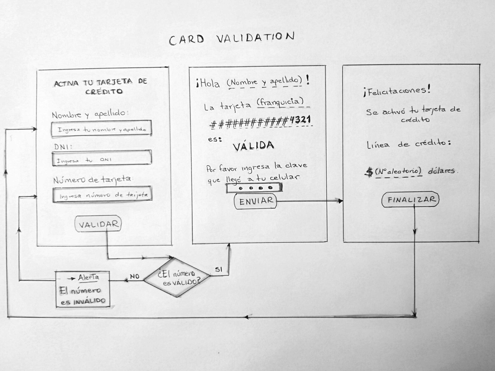
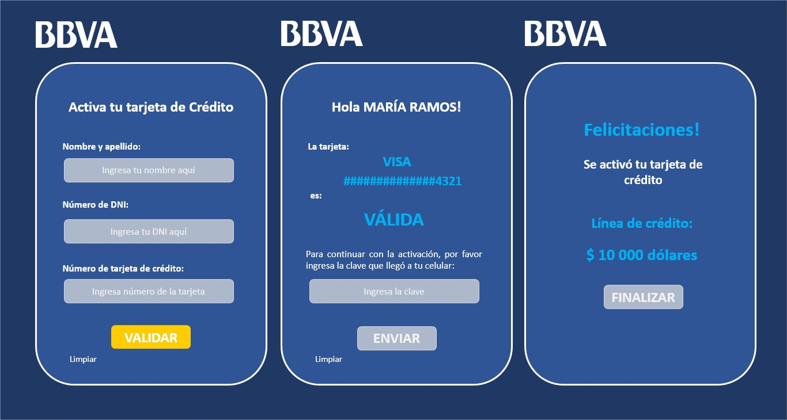

# Activación de tarjeta de crédito 💳 

## Índice

- [1. Resumen](#1-resumen)
- [2. Usuarios y objetivos](#2-usuarios-y-objetivos)
- [3. Identificación de problemas y necesidades](#3-identificación-de-problemas-y-necesidades)
- [4. Primer prototipo](#4-primer-prototipo)
- [5. Resumen de feedback recibido](#5-resumen-de-feedback-recibido)
- [6. Prototipo final](#6-prototipo-final)
- [7. Plan de acción y Objetivos de aprendizaje a priorizar](#7-plan-de-acción-y-objetivos-de-aprendizaje-a-priorizar)

---

## 1. Resumen

Página web para activar una tarjeta de crédito de forma virtual.
El banco previo acuerdo, lleva la tarjeta a tu casa y luego lo activas.

## 2. Usuarios y objetivos

- Los ususarios son personas quiénes desean utilizar una tarjeta de crédito.
- El objetivo del producto es activar una tarjeta de credito de forma virtual.

## 3. Identificación de problemas y necesidades

- El producto está pensado para que las personas no acudan a los bancos
  para activar su tarjeta de crédito. El banco lleva la tarjeta hasta tu
  casa y mediante una validación virtual, puedes activarla y hacer uso de
  tu tarjeta de crédito.

## 4. Primer prototipo

## 5. Resumen de feedback recibido

- Los coaches me orientaron respecto a la instalación de editor de texto,
  interpretador de líneas de comando git y node.js (npm), y como clonar
  un repositorio. Todo esto para iniciar con el desarrollo del proyecto.
- Recibí feedback de mis compañeras respecto al proyecto a presentar y el
  contenido del proyecto (html semántico, objetos, funciones, css, test).
- Recibí feedback para codificar la función de validar el número de
  la tarjeta mediante el algoritmo de Luhn. Las mejoras a realizar estaban
  en relación con la correcta aplicación de los arrays y bucle for.
- Tuve dudas luego de realizar el test, ya que aparecieron algunos términos
  que no comprendía y mostraban errores. Las mejoras a realizar estaban
  enfocados en la adición de código para cada uno de los objetos a evaluar
  en el archivo test. De esta forma logré pasar el test de las funciones
  para validar, enmascarar y obtener franquicia de la tarjeta.

## 6. Prototipo final

## 7. Plan de acción y Objetivos de aprendizaje a priorizar

### Plan de acción

1. Crear una cuenta en Github y clonar el repositorio base del proyecto.
2. Instalar GitHub para escritorio, instalar visual studio code,git bash,
   Node.js (descargar las aplicaciones npm en cosola).
3. Descargar repositorio clonado para editarlo en Visual Studio Code.
4. Realizar el prototipo del proyecto en papel, identificando el problema y
   como el producto satisface la necesidad del usuario.
5. Avanzar parte del contenido README.md
6. Implementar contenido de mi proyecto empleando html semántico y teniendo
   en cuenta la experiencia del usuario.
7. Crear botones para dar funcionalidad al proyecto, empleando conceptos
   del DOM en archivo index.js, para luego vincularlo a los archivos
   index.html y validator.js.
8. Implementar la función para validar tarjeta, previamente estudiando
   conceptos de array, objetos, bucles, condicionales, métodos cómo .split()
   y .reverse(), y más.
9. Implementar función de enmascarado de trajeta, incluyendo conceptos de array,
   bucle for, métodos cómo .split() y .join(), y más.
10. Realizar el test para corroborar el correcto funcionamiento de las funciones,
    implementando código en el archivo test.
11. Implementar contenido en CSS, estudiando previante conceptos para dar estilos
    y sobre los selectores de CSS.
12. Implementar la función para obtener la franquicia de la tarjeta, incluyendo
    conceptos de array y condicionales.
13. Realizar el test para corroborar el correcto funcionamiento de las funciones,
    implementando código en el archivo test para cada objeto.
14. Completar el README.
15. Buscar información sobre como subir avance a GitHub y aplicarlo.
16. Ver algunas mejoras que puedo implementar a mi proyecto.

### Objetivos de aprendizaje a priorizar

#### HTML y CSS

- [x] [Uso de HTML semántico.](https://developer.mozilla.org/en-US/docs/Glossary/Semantics#Semantics_in_HTML)
- [x] Uso de selectores de CSS.
- [x] Construir tu aplicación respetando el diseño realizado (maquetación).

#### DOM

- [x] Uso de selectores del DOM.
- [x] Manejo de eventos del DOM.
- [ ] [Manipulación dinámica del DOM.](https://developer.mozilla.org/es/docs/Referencia_DOM_de_Gecko/Introducci%C3%B3n)
      (appendChild |createElement | createTextNode| innerHTML | textContent | etc.)

#### JavaScript

- [x] Manipulación de strings.
- [x] Uso de condicionales (if-else | switch | operador ternario)
- [x] Uso de bucles (for | for..in | for..of | while)
- [x] Uso de funciones (parámetros | argumentos | valor de retorno)
- [x] Declaración correcta de variables (const & let)

#### Testing

- [x] [Testeo unitario.](https://jestjs.io/docs/es-ES/getting-started)

#### Estructura del código y guía de estilo

- [x] Organizar y dividir el código en módulos (Modularización)
- [x] Uso de identificadores descriptivos (Nomenclatura | Semántica)
- [x] Uso de linter (ESLINT)

#### Git y GitHub

- [x] Uso de comandos de git (add | commit | pull | status | push)
- [x] Manejo de repositorios de GitHub (clone | fork | gh-pages)

#### UX

- [x] Diseñar la aplicación pensando y entendiendo al usuario.
- [x] Crear prototipos para obtener feedback e iterar.
- [x] Aplicar los principios de diseño visual (contraste, alineación, jerarquía)
